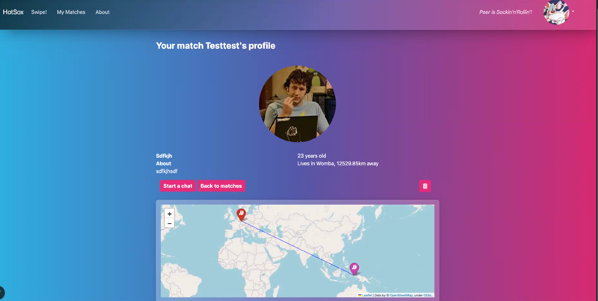

[Return to README.md](../README.md)

# HOTSOX "app_geo-location"

The "app_geo-location" of the HotSox Project handles the User Profiles geolocation and provide of an interactive HTML-based map to visualize user location/s and distances between users on the globe.

The geo-location feature in this application uses a third-party database called GeoLite2 to determine the country and city associated with an IP address.

## MAIN FEATURE: Geo-localization and Geo-visualization

### Purpose

The Geo-location feature is intended to determine the physical location of the device using the Hot-Sox application. This information can be useful for a variety of future potential purposes, such as providing location-based services, delivering targeted advertising, and improving security by identifying potential fraudulent activity.
NOTE: it is important to note that Geo-location is not always accurate, and there may be privacy concerns associated with collecting and using this information. Users should be informed about how their location data will be used and have the option to opt-out if they choose. Additionally, websites and applications should comply with relevant data privacy regulations when collecting and using location data.

### Technical Implementation

The technical implementation of the location feature involves the use of geolocation API to retrieve the user's location. This API provides a simple way for websites to access the user's location information without requiring any additional plugins or software.
Once the user's location is retrieved, the website uses a combination of client-side scripting and server-side programming to process and display the location information to the user.
To enhance the accuracy of the location information, the app incorporated the use of a third-party database: the MaxMind's GeoLite2 database. This database provides IP geolocation data which can be used to estimate the user's location based on their IP address, by parsing the database file, to query the data

### UI/UX

Overall, the UI/UX of this feature is likely to be fairly simple and straightforward, with a focus on providing an useful geolocation data to the user in a clear and concise manner by the use of Folium to display the OpenStreetMap with Mercator Projection onto the webpage corresponding to the approximate location of the user related to its IP address. A marker icon with a pair of sox will mark the User’s city center location.
As soon as a user match with another via the app, a connecting line in blue automatically appears on map, connecting the 2 location and simultaneously the map zoom out to fit the relevant scale of the match on the chart.

### Dependencies

In order to work, the Geo App is using 5 dependencies: Folium, geodesic, Nominatim, GeoIP2 and GeoLite2 Database.

- Folium is a Python library used to create interactive maps with data visualization capabilities.
- Geodesic is part of the GeoPy library and provides functions for calculating geodesic distances on the ellipsoid model of the earth.
- Nominatim is a search engine for OpenStreetMap (OSM) data that can be used to geocode addresses and find points of interest.
- GeoIP2 is a Python library that provides access to MaxMind's binary GeoIP2 databases for geolocation data.
- GeoLite2 Database is a free geolocation database offered by MaxMind that provides IP geolocation data.

### Licenses

The GeoLite2 end-user license agreement applies to the GeoLite2 database used for the geolocation feature. It incorporates components of the Creative Commons Attribution-ShareAlike 4.0 International License. The attribution requirement may be met by including the following in all advertising and documentation mentioning features of or use of GeoLite2 data:

> “This product includes GeoLite2 data created by MaxMind, available from
> <a href="https://www.maxmind.com">https://www.maxmind.com</a>.”
