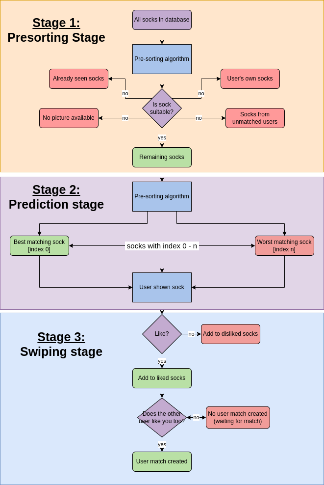

# HOTSOX "app_home"

The "app_home" of the HotSox Project contains the pre_prediction algorithm that handles the match preselection between User/Socks profiles.

## MAIN FEATURE Pre-Prediction Algorithm

### Purpose

The purpose of the 'Pre-Prediction Algorithm' is to predict the next sock that a user might like based on the similarity score calculated from their previous sock preferences.

### Description

The algorithm calculates a similarity score between two socks and then filters out the socks which have already been liked or disliked by the user, as well as the user's own socks. The remaining unseen socks are then sorted in decreasing order of similarity to the user's current sock, and the most similar sock is returned as the next suggested sock match.

### Technical implementation of the features

The **PrePredictionAlgorithm** class contains several static methods used to perform different parts of the pre-prediction algorithm.

The **\_compare_socks** method calculates a similarity score between two socks. The socks are compared based on various attributes such as color, size, type, fabric, condition, holes, age, fabric thickness, kilometers, indoor/outdoor usage, washed status, brand, joining date, separation date, special notes and about notes. Each attribute is assigned a weightage, which is used to calculate the final similarity score for the two socks.
The **\_prefilter_list_of_all_socks** method filters out the socks which have already been liked or disliked by the user, as well as the user's own socks. It also excludes the socks of any users with whom the current user has been matched before and any user that has now been unmatched, and any socks without pictures.

The **get_next_sock** method is the main method of the pre-prediction algorithm.

It first calls the **\_prefilter_list_of_all_socks** method to get the list of remaining unseen socks. It then calculates the similarity score between the current user's sock and each of the remaining socks using the **\_compare_socks** method, and sorts the socks in decreasing order of similarity. Finally, it returns the sock with the highest similarity score as the next suggested sock to match with. If there are no remaining unseen socks, it returns None.
The code imports several modules such as Q, User, Sock, SockLike, UserMatch, random, datetime, timedelta, and SequenceMatcher.
The Q object is used for complex queries, and the SequenceMatcher is used to calculate the similarity ratio between the text attributes of the socks.

## MAIN FEATURE: Swiping process

### Description

